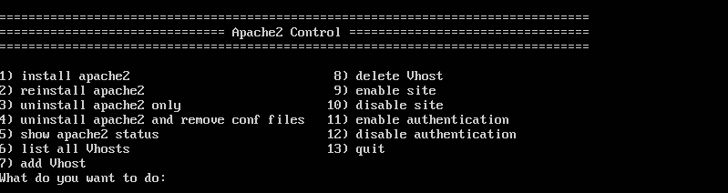

# apache2 control with bash
## ITI bash course project

## main menu option
1. Install apache2
2. Reinstall apache2
3. Uninstall apache2
4. Uninstall apache2 and delete conf files
5. Show apache2 status
6. list Vhosts
7. Add Vhost
8. delete Vhost
9. Enable site
10. Disable Site
11. Enable auth
12. Disable auth
13. Quit

